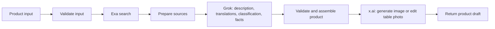

# Product workflow

Импортируемый файл: [0.0.5.yml](0.0.5.yml), приложение `spacex-product`. Один запуск обогащает **одно блюдо** из результата menu; полный список блюд обрабатывается отдельными вызовами.

С 0.0.5 генерируемый контент и карточки — только на английском: описание, отображаемое название, пояснения свойств, факты и плашки. `translations` содержит только `en`, `content_language` и `image.card_language` равны `en`. Параметры `target_languages` и `card_language` удалены из Start; клиентам нужно убрать их из inputs. Исходные названия/описания меню, `source_language`, данные ресторана и цитаты источников сохраняются как источник. Предыдущие примеры русских/сербских карточек ниже относятся к старым версиям.

## Граф



## Подключение

1. Установить официальный Dify-провайдер `langgenius/x` и настроить его x.ai API Key. LLM: `grok-4-fast-non-reasoning`.
2. Импортировать `0.0.5.yml`. В Environment Variables приложения заполнить секреты `XAI_API_KEY` для HTTP-узла изображений и `EXA_API_KEY` для поиска. Локальный `.env` автоматически в Dify не передаётся. `IMAGE_MODEL` по умолчанию `grok-imagine-image-2.0`; доступность модели нужно проверить в аккаунте.
3. Запустить Preview с входами из [example-inputs.json](example-inputs.json). В `product_json` передаётся JSON-строка одного элемента `menu.products`; можно дополнить `category_name` из `menu.categories`.
4. После проверки опубликовать `spacex-product` и получить ключ именно этого приложения для Workflow API. Ключ Dify и ключ x.ai имеют разные назначения; `DIFY_PERSON_API` из `.env` ещё не проверен на пригодность для запуска этого приложения.

## Входы

| Поле | Обязательное | Содержание |
| --- | --- | --- |
| `product_json` | Да | Одно блюдо; обязательно `name`, остальные поля menu сохраняются при наличии |
| `restaurant_context` | Нет | Контекст ресторана и рецептуры для описания |
| `image_prompt` | Нет | Пожелания к стилю изображения |
| `table_image_url` | Нет | Доступная x.ai HTTPS-ссылка на фото стола, например подписанная ссылка хранилища. Локальный путь сюда не подходит |
| `dish_image_url` | Нет | HTTPS-ссылка на фото фактически приготовленного блюда. При наличии изображение переносится на стол с сохранением внешнего вида еды |
| `card_reference_url` | Нет | HTTPS-ссылка на референс графического оформления; пример — `resources/card-reference.jpg`, после загрузки через Files API |

### Карточка блюда и загрузка реального фото

Композиция 0.0.4: квадрат 1:1, камера немного отдалена, вся тарелка по центру шириной 50–60% кадра, вокруг виден стол. Сверху название блюда; в свободном пространстве — жёлтые округлые плашки с пиктограммой, заголовком и пояснением. Фото ресторана используется только как образец поверхности/скатерти и света; общий план помещения не сохраняется. Эти требования добавляются Code-узлом непосредственно в запрос Image API после обработки LLM.

| Фото блюда | Фото стола | Режим |
| --- | --- | --- |
| Нет | Нет | Иллюстрация блюда на нейтральном столе |
| Нет | Есть | Иллюстрация блюда на поверхности в стиле референса |
| Есть | Нет | Улучшение подачи реального блюда на нейтральном столе |
| Есть | Есть | Перенос реального блюда на стол в стиле второго референса |

Для сценария сотрудника: загрузить фото через Dify `POST /v1/files/upload` (с тем же `user`, что и при запуске), взять возвращаемый `source_url` и передать в `dish_image_url` при повторном запуске с прежними ID блюда. Так же загружается `table_image_url`. URL должен оставаться доступным x.ai на время обработки. Входы текущего DSL — URL-строки; кнопку загрузки, сохранение версии карточки и доступ сотрудника реализует будущий фронтенд/бекенд.

При двух фото x.ai получает `images`: сначала блюдо, затем стол. При одном фото — `image`. Промпт требует сохранять состав, порцию, форму и вид реальной еды; улучшать свет и композицию. `image.mode` равен `restyled_dish` при фото блюда или `illustration` без него. Отредактированный результат всё равно требует проверки и не маркируется как необработанная фотография.

В 0.0.4 к этому списку последним добавляется необязательный `card_reference_url`: максимум три изображения в порядке блюдо → стол → дизайн (отсутствующие пропускаются). Для каждого референса в промпте явно указан его номер и назначение. Из card-reference берутся только иерархия текста, плашки, отступы и палитра; предмет, еда и обещания про батарею/нагрев/материалы из референса запрещены. Без него используется то же оформление, описанное словами.

Для карточки сохраняются `image.card_title`, `image.card_language`, `image.card_reference_used`. В 0.0.5 название обязательно берётся из `translations.en.name`, без возврата к исходному языку. `image.badges` содержит английские `headline` и `detail`; короткий `label` остаётся техническим кодом и не печатается. Пример: «Served hot / Enjoy while warm», «Takeaway available / Enjoy wherever you like». Текст задан в коде, не придумывается LLM; лишние преимущества вроде бесплатной упаковки или скорости доставки не добавляются.

### Иконки вокруг блюда

Список строится из `product_json.confirmed` программно, без добавления неподтверждённых AI-свойств. Только `true` включает бейдж; `false` и неизвестное значение — без бейджа.

| Подтверждение | Надпись | Иконка |
| --- | --- | --- |
| `served_hot` | HOT | Пар: горячая подача |
| `spicy` | SPICY | Перец: острое |
| `vegan` | VEGAN | Лист |
| `low_calorie` | LIGHT | Перо |
| `kids_menu` | KIDS | Улыбка |
| `takeaway` | TAKEAWAY | Пакет |

Плашки размещаются симметрично в свободных полях вокруг тарелки, как инфографика товарной карточки, не перекрывая еду. Без подтверждений остаются название и блюдо без иконок. Аллергены автоматически не превращаются в бейджи «без аллергенов». Полный разрешённый список возвращается в `product.image.badges`, независимо от визуального результата. Поскольку иконки и надписи рисует генеративная модель, нужно проверить их точность перед публикацией; метаданные также пригодны для будущего точного наложения средствами UI.

Подтверждения ресторана можно передать внутри `product_json.confirmed`:

```json
{
  "name": "Example dish",
  "confirmed": {
    "ingredients": ["ingredient supplied by restaurant"],
    "vegan": false,
    "spicy": false,
    "kids_menu": false,
    "low_calorie": false,
    "takeaway": true,
    "allergens": ["milk"],
    "allergens_complete": false
  }
}
```

Это пример формата, не сведения о конкретном блюде. Неизвестные поля `confirmed` следует пропускать. Будущий бекенд должен принимать подтверждения только от владельца ресторана; сам workflow аутентификацию владельца не реализует.

## Результат

Выходы End: `product`, `product_json` (весь ответ строкой), `processing`, `warnings`, `status`.

`product` включает:

- исходные `id`, `category_id`, `category_name`, `name`, `price`, `currency`, `portion`, `source_images`, `original_description`;
- созданное `description`, `description_generated`, `source_language`, `translations[language].name/description`;
- `confirmed_ingredients`;
- `classification`: `vegan`, `low_calorie`, `spicy`, `kids_menu`, `takeaway` с `value`, `source`, `suggested_value`, `reason`; отдельный объект `allergens` с подтверждёнными и возможными аллергенами, полнотой списка и неизвестным cross-contact;
- `fun_facts`: до двух фактов с переводами, URL, названием источника и короткой подтверждающей цитатой;
- `nutrition`: калории `null`, статус `unknown` — без рецепта и расчёта числа не выдумываются;
- `image`: URL, промпт, модель, статус, использование референса, признак AI-иллюстрации и временной ссылки;
- `needs_review: true`, `publication_status: draft`.

Подтверждённые значения классификации устанавливаются только из `confirmed`. Предположения LLM остаются в `suggested_value`; без подтверждения `value` равен `unknown`. Факты принимаются только со ссылкой из ответа Exa и цитатой, реально присутствующей в переданном тексте. Это проверка происхождения цитаты, а не автоматическое доказательство истинности или смысловой поддержки факта: редакторская проверка нужна.

## Ошибки и ограничения

- Вызовы Exa и Image имеют Dify fallback (`body: {}`, `status_code: 0`). Ошибка Exa оставляет факты пустыми; ошибка Image сохраняет текстовый продукт и возвращает `partial`. При успехе ответ остаётся `needs_review`, так как контент — черновик.
- Ошибка основного Grok-узла или невалидная структура обогащения останавливает запуск с ошибкой. Автоматических повторов платной генерации изображения нет.
- Без референсов вызывается `/v1/images/generations`; с одним, двумя или тремя — `/v1/images/edits`. В DSL передаются URL, полученные после загрузки файлов.
- URL изображения временный: будущий бекенд должен скачать результат в постоянное хранилище. Здесь нет сохранения в БД, CRUD, публикации меню и генерации QR: это функции приложения/меню, а не обогащения одного продукта.
- Пока каждый запуск делает одну попытку поиска и одну попытку генерации изображения. Для редактирования только текста отдельного режима ещё нет.

## Проверка и версии

| Версия | Изменения | Статус |
| --- | --- | --- |
| 0.0.1 | Первый workflow обогащения продукта | 9 локальных тестов прошли; импорт в Dify и реальные API-вызовы пока не проверены |
| 0.0.2 | Нормализация строковых boolean от Grok, уточнение промпта; builder использует menu/0.0.2.yml | 10 тестов и реальный ответ Grok проходят локально; ожидает публикации в Dify |
| 0.0.3 | Центральный крупный план, опциональное фото блюда, два референса, подтверждённые иконки | 13 локальных тестов прошли; в Dify ещё не опубликована |
| 0.0.4 | Отдаление до 50–60%, референс дизайна, название и подробные локализованные плашки | 16 локальных тестов прошли; в Dify ещё не опубликована |
| 0.0.5 | Только английский для нового контента и карточек, убраны языковые входы | 17 локальных тестов прошли; в Dify пока не опубликована |

Повторная проверка 0.0.5 успешна для публикации и английского контента: run `b55e41e2-080e-4b1e-b575-f1fd27b7912f`, 4.47 с, `workflow_version: 0.0.5`, только `translations.en`, `content_language: en`, `image.card_language: en`; плашки «Served hot / Enjoy while warm» и «Takeaway available / Enjoy wherever you like». Языковые входы удалены из `/parameters`. Название собственное Karađorđeva сохранено. HTTP-узлы Exa/Image ещё падают с `Unknown error`, общий статус `partial-succeeded`, картинки нет. Лог — `tmp/product-005-recheck.json`.

Попытка API-теста 0.0.5: `/info` уже показывает описание 0.0.5, но `/parameters` ещё содержит `target_languages` и `card_language`. Run `e37c0913-4640-4129-8ed8-e39935c22456` вернул sr/en/ru, сербское описание и `image.card_language: sr`, то есть фактически исполняется прежний граф. Вероятно, обновлён черновик/метаданные, но не опубликован новый граф. Нужна публикация 0.0.5 и повторный тест. Exa/Image HTTP также продолжают возвращать `Unknown error`. Лог — `tmp/product-005-dify-run.json`.

Обновление 0.0.4: публикация подтверждена через `/info` и `/parameters`. API-run `c85ab1ed-8951-4681-bf9e-7e158dadd06c` с фото стола и card-reference завершился за 7.37 с как `partial-succeeded`: текст и валидация работают, два референса и подробные русские плашки передаются правильно. Exa и x.ai HTTP по-прежнему возвращают `Unknown error`, `image.url: null`; новая картинка через Dify не получена. Лог — `tmp/product-004-dify-run.json`. Причина HTTP-ошибок ещё не установлена; проверить секреты Environment Variables и детали узлов в Dify.

Прямой визуальный API-тест 0.0.4: `tmp/product-004-card.jpg`. В x.ai переданы референс стола и `resources/card-reference.jpg`, язык ru, тестовые подтверждения горячей подачи и takeaway. Тарелка целиком в кадре, появился заголовок и две читаемые жёлтые плашки с пояснениями, текст/контейнер из референса не перенесены. Модель сделала тарелку крупнее запрошенных 50–60%; точные размеры остаются ограничением генеративного рендера. Это прямой тест запроса x.ai с сохранённым текстовым ответом Grok, не запуск новой версии через Dify. Реальное фото блюда не использовалось.

Визуальный тест 0.0.3 через прямой x.ai Image API: `tmp/product-003-centered.jpg`. Использован реальный референс ресторана и синтетические тестовые подтверждения `served_hot: true`, `takeaway: true` (не сведения от ресторана). Блюдо получилось крупно по центру, фон — клетчатая скатерть, надписи HOT и TAKEAWAY читаемы. Модель приблизила тарелку сильнее заданного размера; точная геометрия и положение иконок не гарантируются. Реальное фото приготовленного блюда ещё не предоставлено: этот режим проверен локально на структуре multi-image запроса, но не визуально на настоящем блюде сотрудника. Опубликованный Dify по-прежнему требует исправления HTTP-узлов; этот пример создан напрямую через x.ai, не сквозным запуском Dify.

Обновление статуса 0.0.1: два API-запуска выявили отказ Exa HTTP-узла и строковое `"false"` от Grok, из-за которого падал валидатор. Прямые Exa и Image API работают. [Подробности и изображение](runs/README.md).

`src/` содержит читаемые исходники Code-узлов и промпта. Они встроены в YAML, поэтому при импорте дополнительных файлов не требуется. `build.py` создаёт snapshot и отказывается перезаписывать существующий. Для следующей версии обновить номер версии/целевой путь и записать новый snapshot.

Локальные тесты: установить зависимости из `requirements-dev.txt`, затем `python dsl/product/test_workflow.py`. Проверяется код из YAML: сохранение исходных полей, подтверждения и предположения, переводы, источники фактов, оба режима Image, частичные ошибки, ссылки графа и пустые секреты.

API-контракты сверены с документацией: [x.ai generation](https://docs.x.ai/developers/model-capabilities/images/generation), [x.ai editing](https://docs.x.ai/developers/model-capabilities/images/editing), [Exa search](https://exa.ai/docs/reference/search). Источник HTTP-узла Dify: [entities.py](https://github.com/langgenius/dify/blob/1.9.1/api/core/workflow/nodes/http_request/entities.py). Совместимость с экспортом пользовательской Dify-инстанции нужно подтвердить.

Два референса и квадратный формат используют [x.ai Multi-Image Editing](https://docs.x.ai/developers/model-capabilities/images/multi-image-editing).

### 0.0.6 — совместимость редактора Dify

Исправлен fallback `headers` обеих HTTP-нод: JSON-строка `'{}'` вместо YAML-объекта `{}`, который попадал в текстовый CodeEditor. Добавлено стандартное поле HTTP `variables: []`. Генерация и английский язык сохранены. Предыдущие snapshots не изменены.

Импортировать `dsl/product/0.0.6.yml`, открыть Exa и x.ai ноды, проверить ключи окружения и опубликовать. Локально: 17 тестов workflow и строгий DSL lint; проверка живого редактора после импорта ещё требуется. См. `scripts/README.md`.

### 0.0.7 — изображения через fal.ai

Готов отдельный вариант `0.0.7.yml`; сборка `python3 dsl/product/build_fal.py` из неизменяемой 0.0.6 и `src/fal_adapter.py`. Текстовый Grok и Exa сохранены. Изображения: Grok Imagine 2.0 через fal.ai, `text-to-image` без референсов и `edit` с 1–3 референсами в порядке блюдо → стол → карточка. Формат 1:1, JPEG, 1k. Ответ читается из `images[0].url`; `product.image.http_status` помогает диагностике (0 означает fallback, а не HTTP-код провайдера).

1. Создать ключ на https://fal.ai/dashboard/keys . Для локального теста положить `FAL_KEY` в `.env`.
2. Импортировать 0.0.7 в Dify и заполнить секрет `FAL_KEY` в Environment Variables, также сохранить `EXA_API_KEY` и настроенный xAI LLM provider.
3. Авторизация HTTP уже задана заголовком `Authorization: Key …`; Bearer включать не надо.
4. Передавать свежие публично доступные фото-ссылки. Истёкшие Dify preview URL останутся недоступны и для fal.ai.
5. Открыть HTTP-ноду, запустить тест и опубликовать после проверки.

Для быстрого демо используется прямой синхронный `https://fal.run/...` с read timeout 120 секунд и без автоматических повторов. Долгая генерация может превысить таймаут Dify; для такого сценария следующий шаг — очередь fal с получением результата. Переход на fal не гарантирует устранение ошибки прямого x.ai: её HTTP-ответ пока не получен.

Проверено локально: строгий DSL lint, 3 теста fal (включая все 8 комбинаций референсов, успешный ответ и ошибки), 17 тестов базового workflow. Живой fal-вызов не выполнен: `FAL_KEY` отсутствует в локальном `.env` на момент подготовки.

Документация: https://fal.ai/models/xai/grok-imagine-image/v2.0/edit/api , https://fal.ai/models/xai/grok-imagine-image/v2.0/text-to-image/api , https://fal.ai/docs/documentation/model-apis/inference/synchronous .

### 0.0.8 — не переносить текст с рекламного референса

После теста с `card-reference.jpg` модель скопировала русский рекламный footer про контейнер, несмотря на запрет в промпте. Теперь fal получает только фото блюда и стола. Поле `card_reference_url` оставлено для совместимости входа, но изображение не отправляется провайдеру; `card_reference_used=false`, `card_style_source=text_preset`. Жёлтые панели и композиция по-прежнему описаны в промпте. Явно запрещён нижний баннер; текст ограничен английским названием и подтверждёнными панелями. Без подтверждённых свойств разрешено только название.

Сборка: `python3 dsl/product/build_fal.py`; импорт с ключами: `python3 scripts/dsl_release.py dsl/product/0.0.8.yml`. Старые версии сохранены. Локальные проверки: DSL lint и 3 теста fal с восемью комбинациями входных референсов.
