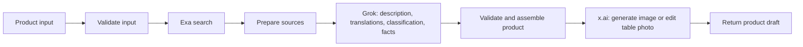

# Product workflow

Импортируемый файл: [0.0.1.yml](0.0.1.yml), приложение `spacex-product`. Один запуск обогащает **одно блюдо** из результата menu; полный список блюд обрабатывается отдельными вызовами.

## Граф



## Подключение

1. Установить официальный Dify-провайдер `langgenius/x` и настроить его x.ai API Key. LLM: `grok-4-fast-non-reasoning`.
2. Импортировать `0.0.1.yml`. В Environment Variables приложения заполнить секреты `XAI_API_KEY` для HTTP-узла изображений и `EXA_API_KEY` для поиска. Локальный `.env` автоматически в Dify не передаётся. `IMAGE_MODEL` по умолчанию `grok-imagine-image-2.0`; доступность модели нужно проверить в аккаунте.
3. Запустить Preview с входами из [example-inputs.json](example-inputs.json). В `product_json` передаётся JSON-строка одного элемента `menu.products`; можно дополнить `category_name` из `menu.categories`.
4. После проверки опубликовать `spacex-product` и получить ключ именно этого приложения для Workflow API. Ключ Dify и ключ x.ai имеют разные назначения; `DIFY_PERSON_API` из `.env` ещё не проверен на пригодность для запуска этого приложения.

## Входы

| Поле | Обязательное | Содержание |
| --- | --- | --- |
| `product_json` | Да | Одно блюдо; обязательно `name`, остальные поля menu сохраняются при наличии |
| `target_languages` | Нет | От 1 до 6 кодов через запятую, по умолчанию `sr,en,ru` |
| `restaurant_context` | Нет | Контекст ресторана и рецептуры для описания |
| `image_prompt` | Нет | Пожелания к стилю изображения |
| `table_image_url` | Нет | Доступная x.ai HTTPS-ссылка на фото стола, например подписанная ссылка хранилища. Локальный путь сюда не подходит |

Подтверждения ресторана можно передать внутри `product_json.confirmed`:

```json
{
  "name": "Example dish",
  "confirmed": {
    "ingredients": ["ingredient supplied by restaurant"],
    "vegan": false,
    "spicy": false,
    "kids_menu": false,
    "low_calorie": false,
    "takeaway": true,
    "allergens": ["milk"],
    "allergens_complete": false
  }
}
```

Это пример формата, не сведения о конкретном блюде. Неизвестные поля `confirmed` следует пропускать. Будущий бекенд должен принимать подтверждения только от владельца ресторана; сам workflow аутентификацию владельца не реализует.

## Результат

Выходы End: `product`, `product_json` (весь ответ строкой), `processing`, `warnings`, `status`.

`product` включает:

- исходные `id`, `category_id`, `category_name`, `name`, `price`, `currency`, `portion`, `source_images`, `original_description`;
- созданное `description`, `description_generated`, `source_language`, `translations[language].name/description`;
- `confirmed_ingredients`;
- `classification`: `vegan`, `low_calorie`, `spicy`, `kids_menu`, `takeaway` с `value`, `source`, `suggested_value`, `reason`; отдельный объект `allergens` с подтверждёнными и возможными аллергенами, полнотой списка и неизвестным cross-contact;
- `fun_facts`: до двух фактов с переводами, URL, названием источника и короткой подтверждающей цитатой;
- `nutrition`: калории `null`, статус `unknown` — без рецепта и расчёта числа не выдумываются;
- `image`: URL, промпт, модель, статус, использование референса, признак AI-иллюстрации и временной ссылки;
- `needs_review: true`, `publication_status: draft`.

Подтверждённые значения классификации устанавливаются только из `confirmed`. Предположения LLM остаются в `suggested_value`; без подтверждения `value` равен `unknown`. Факты принимаются только со ссылкой из ответа Exa и цитатой, реально присутствующей в переданном тексте. Это проверка происхождения цитаты, а не автоматическое доказательство истинности или смысловой поддержки факта: редакторская проверка нужна.

## Ошибки и ограничения

- Вызовы Exa и Image имеют Dify fallback (`body: {}`, `status_code: 0`). Ошибка Exa оставляет факты пустыми; ошибка Image сохраняет текстовый продукт и возвращает `partial`. При успехе ответ остаётся `needs_review`, так как контент — черновик.
- Ошибка основного Grok-узла или невалидная структура обогащения останавливает запуск с ошибкой. Автоматических повторов платной генерации изображения нет.
- Без фото стола вызывается `/v1/images/generations`; с фото — `/v1/images/edits` с JSON `image.url`. В этой версии вход для референса — URL, не Dify file-upload.
- URL изображения временный: будущий бекенд должен скачать результат в постоянное хранилище. Здесь нет сохранения в БД, CRUD, публикации меню и генерации QR: это функции приложения/меню, а не обогащения одного продукта.
- Пока каждый запуск делает одну попытку поиска и одну попытку генерации изображения. Для редактирования только текста отдельного режима ещё нет.

## Проверка и версии

| Версия | Изменения | Статус |
| --- | --- | --- |
| 0.0.1 | Первый workflow обогащения продукта | 9 локальных тестов прошли; импорт в Dify и реальные API-вызовы пока не проверены |

`src/` содержит читаемые исходники Code-узлов и промпта. Они встроены в YAML, поэтому при импорте дополнительных файлов не требуется. `build.py` создаёт snapshot и отказывается перезаписывать существующий. Для следующей версии обновить номер версии/целевой путь и записать новый snapshot.

Локальные тесты: установить зависимости из `requirements-dev.txt`, затем `python dsl/product/test_workflow.py`. Проверяется код из YAML: сохранение исходных полей, подтверждения и предположения, переводы, источники фактов, оба режима Image, частичные ошибки, ссылки графа и пустые секреты.

API-контракты сверены с документацией: [x.ai generation](https://docs.x.ai/developers/model-capabilities/images/generation), [x.ai editing](https://docs.x.ai/developers/model-capabilities/images/editing), [Exa search](https://exa.ai/docs/reference/search). Источник HTTP-узла Dify: [entities.py](https://github.com/langgenius/dify/blob/1.9.1/api/core/workflow/nodes/http_request/entities.py). Совместимость с экспортом пользовательской Dify-инстанции нужно подтвердить.
